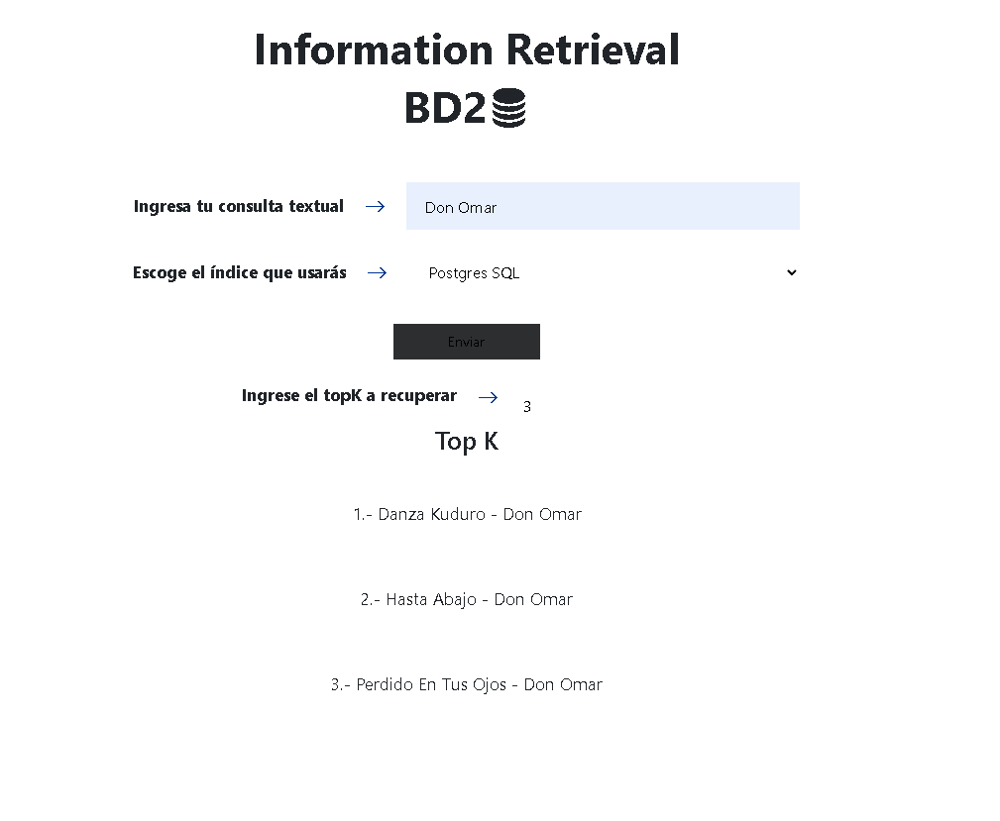
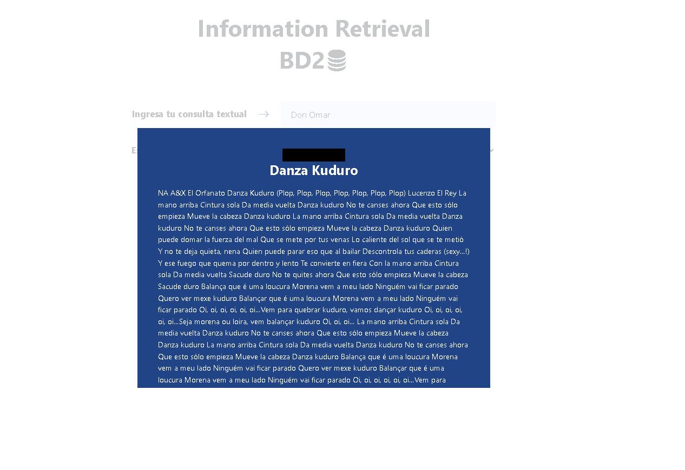

# Proyecto-BD2-2

## Introducción

### Objetivos
El principal objetivo de este proyecto es implementar y entender el funcionamiento del índice invertido usando el modelo de recuperación por ranking para consultas de texto libre. Con esto, esperamos mejorar la velocidad y eficiencia de las búsquedas en grandes conjuntos de datos.

### Objetivos Específicos:
-  Construir óptimamente un Índice Invertido para tareas de búsqueda y recuperación en documentos de texto
-  Construir una estructura multidimensional para dar soporte a las búsqueda y recuperación eficiente de imágenes / audio usando vectores característicos.
### Descripción del dominio de datos y la importancia de aplicar indexación
Utilizamos un dataset proporcionado en formato de tabla, que contiene información sobre canciones disponibles en Spotify. Cada fila de la tabla se compone de múltiples campos textuales que se concatenan para formar un solo texto. Nuestro dataset de Spotify incluye campos como track_id, track_name, track_artist, lyrics, track_popularity, entre otros. Por ejemplo:
```
track_id: 0017A6SJgTbfQVU2EtsPNo
track_name: Pangarap
track_artist: Barbie's Cradle
lyrics: Minsan pa Nang ako'y napalingon...
track_popularity: 41
track_album_name: Trip
playlist_name: Pinoy Classic Rock
...
```
Sin indexación, una consulta de búsqueda requeriría escanear cada documento en la base de datos, lo que sería altamente ineficiente en conjuntos de datos grandes. El índice invertido, en particular, es beneficioso ya que proporciona una estructura de datos optimizada para consultas de texto libre.

## Backend
### Índice Invertido
El código presentado es para construir un índice invertido para un conjunto de documentos, en este caso, canciones de Spotify, utilizando el algoritmo SPIMI (Single-pass in-memory indexing). Se usan las principales librerías
```
import math
import pickle
import os
import nltk
nltk.download('stopwords')
nltk.download('punkt')
```
### Preprocesamiento de texto
Se establecen stopwords en inglés y español, además de stemmers para procesar el texto y dejarlo en un formato estandarizado. La función preprocess_text lleva a cabo este proceso. La función devuelve el texto preprocesado como una cadena de caracteres con tokens separados por espacios. Se aplica Stemming que es una técnica de procesamiento del lenguaje natural que se utiliza para reducir las palabras a su raíz o forma base. Por ejemplo, "running" se convierte en "run". 
```
stop_words = set(stopwords.words('english')).union(set(stopwords.words('spanish')))
block_num = 0
stemmer_english = SnowballStemmer('english')
stemmer_spanish = SnowballStemmer('spanish')

def preprocess_text(text):
    text = ' '.join([word for word in word_tokenize(text) if word.isalpha()])
    tokens = word_tokenize(text)
    tokens = [word for word in tokens if word.lower() not in stop_words]
    stemmer = stemmer_spanish if "el" in tokens or "la" in tokens else stemmer_english
    stemmed_tokens = [stemmer.stem(token) for token in tokens]
    return ' '.join(stemmed_tokens)
```

### SPIMI
La función spimi_invert construye índices invertidos en bloques utilizando el algoritmo SPIMI. Esta función toma como entrada la lista de documentos y, para cada documento, construye una lista de términos (o tokens) y su frecuencia de aparición. Los bloques de índice invertido se escriben en el disco cuando se alcanza un límite específico de memorias definido por page_size.
Se inicializan variables para mantener el índice invertido (inv_index), las listas de publicaciones (posting_lists), y otros contadores.
Se itera sobre cada documento en docs:

- Para cada documento, se cuentan las ocurrencias de cada término usando la clase Counter.
- Luego, para cada término y su frecuencia en el documento:
  
Se verifica si el tamaño total de inv_index y posting_lists cuando se convierten a formato pickle supera el page_size. Si es así, se escribe el contenido actual de inv_index y posting_lists en el disco y se reinician estas estructuras.

- Luego, se verifica si el término ya está en el índice invertido. Si no está, se añade al índice y se crea una nueva lista de publicaciones para ese término. Si ya está, se actualiza la lista de publicaciones con la frecuencia del término para el documento actual.
  
Al final de la función, se devuelve el contador indice, que representa la cantidad total de índices o bloques generados.
```
def generate_tfw(docs):
    inv_index = {}
    posting_lists = []
    block_num = 0
    last_block_num = 0
    indice = 0

    for doc_id, doc in enumerate(docs):
        terms = doc.split(' ')
        terms_counted = Counter(terms)
        # print(doc_id, ": ", Counter(terms))

        for term, freq in terms_counted.items():
            tamaño = len(pickle.dumps(inv_index)) + len(pickle.dumps(posting_lists))
            if tamaño > page_size:
                write_to_disk(inv_index, posting_lists, indice, last_block_num)
                indice += 1
                last_block_num = block_num
                inv_index.clear()
                posting_lists.clear()

            if term not in inv_index:
                inv_index[term] = [1, block_num]  # [df, block_num]
                block_num += 1
                posting_lists.append({'next': -1, doc_id: score_tf(freq)})
            else:
                posting_lists[inv_index[term][1] - last_block_num][doc_id] = score_tf(freq)
                inv_index[term][0] += 1
    print(block_num, indice)
    return indice
```
### Merge
La función merge_blocks es la responsable de fusionar bloques más pequeños del índice invertido en un índice invertido más grande. Las listas de publicaciones de términos coincidentes en diferentes bloques se combinan para crear una única lista de publicaciones para ese término en el nuevo índice invertido fusionado. Después de fusionar dos bloques de índices invertidos, se eliminan los archivos originales para conservar espacio y evitar confusiones.
```
def merge_blocks(indices):
    new_inv_idx = {}
    for i in range(indices):
        inv_index1 = {}
        with open(f"indices/indice_invertido{i}.pkl", "rb") as file:
            inv_index1 = pickle.load(file)
            json_index1 = json.dumps(inv_index1, indent=3)
        if os.path.exists(f"indices/indice_invertido{i}.pkl"):
            print("eiminando")
            os.remove(f"indices/indice_invertido{i}.pkl")
        for j in range(i):
            inv_index2 = {}
            with open(f"indices/indice_invertido{j}.pkl", "rb") as file:
                inv_index2 = pickle.load(file)
                json_index2 = json.dumps(inv_index2, indent=3)
            if os.path.exists(f"indices/indice_invertido{j}.pkl"):
                print("eiminando")
                os.remove(f"indices/indice_invertido{j}.pkl")
            w = 0
            for x in range(len(inv_index1.keys())):
                term1 = inv_index1.keys()[x]
                term2 = inv_index2.keys()[w]
                if term1 < term2:
                    new_inv_idx[term1] = inv_index1[term1]
                elif term1 > term2:
                    new_inv_idx[term2] = inv_index2[term2]
                    w += 1
                else:
                    new_inv_idx[term1] = [
                        inv_index1[term1][0] + inv_index2[term2][0],
                        inv_index2[term2][1]
                    ]
                    w += 1
                    bloque1 = inv_index1[term1][1]
                    bloque2 = inv_index2[term2][1]
                    postings1 = {}
                    postings2 = {}
                    with open(f"blocks/bloque{bloque1}", 'rb') as posting1, open(f"blocks/bloque{bloque2}", 'rb') as posting2:
                        postings1 = pickle.load(posting1)
                        postings2 = pickle.load(posting2)
                    del postings1['next']
                    postings3 = {**postings2, **postings1}
```

### Similitud Coseno
El método score_documents toma como parámetros una consulta (query) y un índice invertido fusionado (merged_index). Luego, se divide la consulta en términos individuales y se inicializa un diccionario doc_scores para almacenar los scores de los documentos. Para cada término en la consulta, si el término está en el índice invertido, se itera a través de las listas de publicación (documentos que contienen el término) y se acumula el valor de TF-IDF para ese término en el score del documento.
Luego, se normaliza el score del documento dividiendo el score acumulado por la longitud del documento. Finalmente, se multiplica el score del documento por la cantidad de términos de la consulta que coinciden con el documento. Esto es un factor adicional para aumentar el score de los documentos que contienen más términos de la consulta.
```
def score_documents(query, merged_index):
    print("APLICANDO COSINE...")
    query_terms = query.split()
    doc_scores = defaultdict(float)

    for term in query_terms:
        if term in merged_index:
            for doc_id, doc_data in merged_index[term]["postings"].items():
                doc_weight = doc_data['tf-idf']
                doc_scores[doc_id] += doc_weight

    for doc_id, score in doc_scores.items():
        doc_length = sum([doc_data['tf-idf']**2 for term in merged_index if doc_id in merged_index[term]["postings"]])**0.5  
        if doc_length > 0:
            doc_scores[doc_id] /= doc_length

        terms_matched = sum([1 for term in query_terms if term in merged_index and doc_id in merged_index[term]["postings"]])  
        doc_scores[doc_id] *= terms_matched
    return doc_scores
```
### Estructura y Ejecución del índice

### Indice en PostgresSQL
- Se crea una tabla llamada songslist con múltiples campos, que incluyen detalles de la canción, el álbum, la lista de reproducción, características de la canción y más.
Población de Datos:

- Se usa el comando COPY para insertar datos de un archivo CSV (spotify.csv) en la tabla songslist.
Columna combined_text:

- Se añade una columna llamada combined_text, que combinara el contenido de todas las otras columnas en una sola columna de texto.
Conversión a tsvector:

- La columna full_text se crea y se rellena con el contenido de combined_text convertido a tsvector. El tipo tsvector es un tipo de datos específico de PostgreSQL utilizado para representar documentos en un formato que se puede buscar con índices invertidos. Aquí, setweight se usa para asignar un peso específico a los vectores, lo que puede influir en la clasificación de los resultados de búsqueda.
- Creación del Índice:

    - Se crea un índice usando la extensión gin (Generalized Inverted Index) en la columna combined_text. Esto permite búsquedas rápidas de texto completo en la columna combined_text
```
CREATE TABLE IF NOT EXISTS songslist (
    track_id VARCHAR(255) PRIMARY KEY,
    track_name VARCHAR(255),
    track_artist VARCHAR(255),
    lyrics TEXT,
    track_popularity INTEGER,
    track_album_id VARCHAR(255),
    ... Demas campos
);
COPY songslist(track_id, track_name, track_artist, lyrics, track_popularity, track_album_id, track_album_name, track_album_release_date, playlist_name, playlist_id, playlist_genre, playlist_subgenre, danceability, energy, key, loudness, mode, speechiness, acousticness, instrumentalness, liveness, valence, tempo, duration_ms, language)
FROM 'E:\BD2\PROYECTO2\Proyecto-BD2-2\backend\spotify.csv' DELIMITER ',' CSV HEADER;
ALTER TABLE songslist ADD COLUMN combined_text TEXT;
UPDATE songslist
SET combined_text = 
    COALESCE(track_id, '') || ' ' ||
    COALESCE(track_name, '') || ' ' ||
    COALESCE(track_artist, '') || ' ' ||
    COALESCE(lyrics, '') || ' ' ||
    COALESCE(track_popularity::TEXT, '') || ' ' ||
    COALESCE(track_album_id, '') || ' ' ||
    COALESCE(track_album_name, '') || ' ' ||
    ... Demas campos
UPDATE songslist
SET combined_text = TRIM(BOTH ' ' FROM combined_text);
ALTER TABLE songslist ADD COLUMN full_text tsvector;
UPDATE songslist SET full_text = T.full_text
FROM (
    SELECT track_id, setweight(to_tsvector('english', combined_text), 'A') AS full_text
    FROM songslist
) T
WHERE T.track_id = songslist.track_id;
CREATE INDEX text_search_idx ON songslist USING gin(combined_text gin_trgm_ops);
SELECT track_id, track_artist, lyrics, ts_rank_cd(full_text, query) AS rank
FROM songslist, to_tsquery('english', 'Don|Omar') query
WHERE query @@ full_text
ORDER BY rank ASC
LIMIT 100;
```
La función de búsqueda toma una consulta Q y un número k para devolver los k resultados superiores basados en la coincidencia de texto completo. La consulta se divide y se reformatea para adaptarse a la función to_tsquery. La consulta SQL busca coincidencias en la columna full_text y devuelve artistas, nombres de canciones y una puntuación de coincidencia (rank).
```
def search(Q, k):
    query = Q.split(" ")
    query = '|'.join(query)
    top_k = k
    start = time.time()
    cur.execute(f"""
        SELECT track_artist, track_name, ts_rank_cd(full_text, query, 1) AS rank
        FROM songslist, to_tsquery('english', '{query}') query
        WHERE query @@ full_text
        ORDER BY rank ASC
        LIMIT {top_k};
    """)

    end = time.time()
    result = cur.fetchall()
    conn.commit()
    conn.close()
    for row in result:
        print(row)
    print("Tiempo de ejecucion :",
          (end - start) * 10 ** 3, "ms")
```
### KNN-HighD
Debido a que un índice para espacios vectoriales reduce su eficiencia con dimensiones muy altas, el uso de FAISS (Facebook Al Similitary Search), una biblioteca desarrollada por Facebook AI, diseñada para abordar de manera eficiente espacios vectoriales con dimensiones altas. 
Es un hecho que mientras más alta la dimensionalidad de los datos, mas complejo se vuelve encontrar similitud. Sin embargo, FAISS, con su capacidad para manejar eficientemente datos de alta dimensión, ofreciendo la flexibilidad de poder elegir entre búsquedas exactas y aproximadas lo que permite tener un balance entre precisión y velocidad.

#### IndexLSK
El `IndexLSH` en FAISS es un tipo de índice que utiliza el metodo Locality-Sensitive Hashing.
##### Caracteristicas
a

### FLASK API
El archivo views.py es una parte central de la aplicación Flask que se encarga de definir y manejar las rutas o endpoints a los que se puede acceder. Estos endpoints permiten realizar con un índice invertido y una base de datos PostgreSQL. 
Importaciones:
- Flask: Se importan las funciones request y jsonify de Flask. request permite acceder a los datos enviados por el cliente, mientras que jsonify facilita la devolución de respuestas en formato JSON.
- app: Se importa la instancia de Flask (app) desde el módulo app.
- indice: Este módulo contiene funciones relacionadas con el índice invertido.
- database: Este módulo tiene funciones para interactuar con una base de datos PostgreSQL.
La conexión a PostgresSQL se hace usando Pyscopg2
```
import psycopg2
import time
conn = psycopg2.connect(
    host="localhost",
    database="BD2Proyecto2",
    user=
    port = 5432,
    password=

cur = conn.cursor()
```
Endpoints:
```
@app.route('/invert_index', methods=['POST'])
def invert_index():
    query_text = request.json.get('query_text')
    top_k = int(request.json.get('top_k'))
    query_processed = indice.preprocess_text(query_text)
    results = indice.retrieve_top_k(query_processed, top_k, indice.merged_index, indice.num_docs)
    results_list = results.to_dict(orient='records')
    print("Llamado a Indice") 
    return jsonify(results_list)
```
Este endpoint espera una petición POST con un cuerpo que contiene un query_text y un top_k. Primero, se procesa el query_text utilizando la función preprocess_text del módulo indice. Luego, se llama a la función retrieve_top_k del mismo módulo para obtener los top_k resultados más relevantes. Los resultados se convierten a un formato de lista de diccionarios. Finalmente, se devuelve la lista de resultados en formato JSON.

Ruta de PostgreSQL:
```
@app.route('/psql', methods=['POST'])
def psql():
    data = request.get_json()
    query = data["query_text"]
    top_k = int(data["top_k"])

    conn = database.connect() 
    results = database.search(conn, query, top_k)  
    conn.close()
    print("Llamado a PSQL") 
    return jsonify(results)
```
Este endpoint también espera una petición POST con un cuerpo que contiene un query_text y un top_k. Se establece una conexión con la base de datos utilizando la función connect del módulo database. Se utiliza la función search del módulo database para buscar en la base de datos y obtener resultados. Una vez obtenidos los resultados, se cierra la conexión con la base de datos. Los resultados se devuelven en formato JSON.

Prueba en postman:


## FrontEnd




