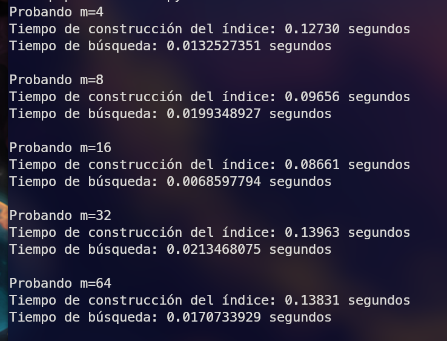

# Proyecto-BD2-2

## Lista de Actividades

| Integrante                         | Tareas                 |
|-----------------------------------|------------------------------|
| Coorahua Peña, Ruben Aaron        |                              |
| Golac Córdova, Luis David         |                              |
| Loza Mendoza, Sebastián           |                              |
| Pajuelo Reyes, César Eduardo      |                              |
| Rodríguez Gutiérrez, Gonzalo Alonso|                             |

## Introducción

### Objetivos
El principal objetivo de este proyecto es implementar y entender el funcionamiento del índice invertido usando el modelo de recuperación por ranking para consultas de texto libre. Con esto, esperamos mejorar la velocidad y eficiencia de las búsquedas en grandes conjuntos de datos. Ademas de implementar un índice multidimencional utilizando diferentes algoritmos, permitiendo realizar una comparacion entre ellos.

### Objetivos Específicos:
-  Construir óptimamente un Índice Invertido para tareas de búsqueda y recuperación en documentos de texto
-  Construir una estructura multidimensional para dar soporte a las búsqueda y recuperación eficiente de imágenes / audio usando vectores característicos.
### Descripción del dominio de datos y la importancia de aplicar indexación
Utilizamos un dataset proporcionado en formato de tabla, que contiene información sobre canciones disponibles en Spotify. Cada fila de la tabla se compone de múltiples campos textuales que se concatenan para formar un solo texto. Nuestro dataset de Spotify incluye campos como track_id, track_name, track_artist, lyrics, track_popularity, entre otros. Por ejemplo:
```
track_id: 0017A6SJgTbfQVU2EtsPNo
track_name: Pangarap
track_artist: Barbie's Cradle
lyrics: Minsan pa Nang ako'y napalingon...
track_popularity: 41
track_album_name: Trip
playlist_name: Pinoy Classic Rock
...
```
Sin indexación, una consulta de búsqueda requeriría escanear cada documento en la base de datos, lo que sería altamente ineficiente en conjuntos de datos grandes. El índice invertido, en particular, es beneficioso ya que proporciona una estructura de datos optimizada para consultas de texto libre.

## Backend
### Índice Invertido
El código presentado es para construir un índice invertido para un conjunto de documentos, en este caso, canciones de Spotify, utilizando el algoritmo SPIMI (Single-pass in-memory indexing). Se usan las principales librerías
```python
import math
import pickle
import os
import nltk
nltk.download('stopwords')
nltk.download('punkt')
```
### Preprocesamiento de texto
Se establecen stopwords en inglés y español, además de stemmers para procesar el texto y dejarlo en un formato estandarizado. La función preprocess_text lleva a cabo este proceso. La función devuelve el texto preprocesado como una cadena de caracteres con tokens separados por espacios. Se aplica Stemming que es una técnica de procesamiento del lenguaje natural que se utiliza para reducir las palabras a su raíz o forma base. Por ejemplo, "running" se convierte en "run". 
```python
stop_words = set(stopwords.words('english')).union(set(stopwords.words('spanish')))
block_num = 0
stemmer_english = SnowballStemmer('english')
stemmer_spanish = SnowballStemmer('spanish')

def preprocess_text(text):
    text = ' '.join([word for word in word_tokenize(text) if word.isalpha()])
    tokens = word_tokenize(text)
    tokens = [word for word in tokens if word.lower() not in stop_words]
    stemmer = stemmer_spanish if "el" in tokens or "la" in tokens else stemmer_english
    stemmed_tokens = [stemmer.stem(token) for token in tokens]
    return ' '.join(stemmed_tokens)
```

### SPIMI
La función spimi_invert construye índices invertidos en bloques utilizando el algoritmo SPIMI. La función generate_tfw(docs) toma como entrada la lista de documentos y, para cada documento, construye una lista de términos (o tokens) para construir un primer índice que sólo tendrá las frecuencias de los términos en cada documento. Para esto hace lo siguiente:
- Para cada documento, se cuentan las ocurrencias de cada término usando la clase Counter.
- Luego, para cada término y su frecuencia en el documento:
  
Se agrega el término a un diccionario inv_index con la key como el término y su value una lista que tiene 2 valores: El df (frecuencia de documento) y el num_bloque (el num de bloque donde estará su posting list), además que se agrega  a su posting list que es un diccionario el id del documento y tf_suavizado respectivo. En el caso ocurra que agregar este nuevo término al inv_index hace que se supere el límite de RAM disponible para el índice no se agrega y se escribe en memoria secundaria.

En caso el término ya pertenezca al índice invertido se agrega el nuevo documento al posting list y se aumenta el df del término.
  
Al final de la función, se devuelve la cantidad de bloques escritos en memoria secundaria.

El código está [aquí](/backend/indiceInvertido.py#generate-tfw-docs)

### Merge
Para el merge se realizan distintas operaciones separadas en distintas funciones (*merge()*, *merge_interno()*, *combine_indices()*, *combine_blocks()*, *actualizar_tf_idf()*, *actualizar_block()*)
- Merge()
  
  Esta función va a ejecutarse mientras hayan bloques sin mergearse. Es decir, mientras existan archivos dentro de nuestra carpeta "indices" se llamará a una función *merge_interno()*. Una vez que se termine de mergearse, se tendrá en nuestra carpeta final a los bloques que contienen a nuestro índice ya mergeado y se empezará a crear la norma a su vez que se actualizarán los valores idf final para cada token ya que ya se tiene un índice con todos los tokens y que se repiten una sóla vez y con su valor final del df (document frequency), esto se hará en *actualizar_tf_idf(norma)*. Puedes encontrar el código [aquí](/backend/indiceInvertido.py#merge)
- merge_interno()

  Esta es una de las funciones principales. Aquí se mergeará a todos los índices ya mergeados con el nuevo índice sin mergear para el cuál se ha llamado esta función. Se recorrerá a todos los archivos en la carpeta de índices mergeados y al mergearse se escribirán dentro de otra carpeta auxiliar dnde se escribirá el resultado, cuando esta función sea llamada nuevamente la carpeta de índices mergeados será esta carpeta auxiliar y se usará como auxiliar a la carpeta que antes fue la carpeta de índices mergeados, y así se intercalará en cada llamada a la función. Esta función usa la lógica normal para mergear 2 diccionarios, pero cuando encuentra tokens que son iguales, tiene que usar una lógica un poco más compleja para también mergear a los bloques que tienen asociados cada uno. A su vez que va verifiando si el tamaño del indice local, más el tamaño de un bloque de posting lists supera el tamaño máximo permitido por la RAM y se escribe en el bloque auxiliar. Puedes encontrar el código [aquí](/backend/indiceInvertido.py#merge-interno)
- combine_indices()

  En esta función se combinan los bloques de las postings list de un token que se ha combinado en el mergeo de nuestro índice invertido, en caso se sobrapase el límite permitido en una posting list, se escribe en memoria secundaria y se encadena un nuevo bloque para así poder seguir ingresando los postings/documentos correspondientes al token que se ha mergeado, esto se hace en la función *combine_blocks()*. Puedes encontrar el código [aquí](/backend/indiceInvertido.py#combine-indices)

- actualizar_tf_idf()

  En esta función se leeran todos los bloques en memoria secundaria y se irán actualizando el valor idf y se pondrá en la primera posición de la lista que representa al value de cada token. Seguido de eso se llamará a una función *actualizar_bloque(num_bloque, idf, norma)* para cada token. Puedes encontrar el código [aquí](/backend/indiceInvertido.py#actualizar-tf-idf)

- actualizar_bloque()

  Esta es una función recursiva que abrirá a todos los bloques encadenados asociados al token para el que fue llamado la función y se actualizará el valor de tf para cada documento asociado a ese token en ese bloque con el valor de tf*idf y se volverá a escribir en en el mismo archivo. También se irá calculando el valor para la norma de cada documento. Puedes encontrar el código [aquí](/backend/indiceInvertido.py#actualizar-block)


### Similitud Coseno
Para la similitud por coseno usamos la función *binary-recollection()* para cada token perteneciente a la consulta textual. Para esto previamente hemos calculado los valores tf-suavizados de ls términos de la query. El *binary_recollection()* nos ayuda a obtener los número de bloques de los tokens haciendo una búsqueda binaria en el índice invertido en memora secundaria para así no traer todos los bloques a la RAM. Luego de haber obtenido los número de bloques de cada término de la query en el índice invertido podemos leerlos y con el tf-idf que tenemos guardado y con los valores de la norma, de cada documento aplicamos la fórmula de la similitud de coseno:


### Estructura y Ejecución del índice

### Indice en PostgresSQL
- Se crea una tabla llamada songslist con múltiples campos, que incluyen detalles de la canción, el álbum, la lista de reproducción, características de la canción y más.
Población de Datos:

- Se usa el comando COPY para insertar datos de un archivo CSV (spotify.csv) en la tabla songslist.
Columna combined_text:

- Se añade una columna llamada combined_text, que combinara el contenido de todas las otras columnas en una sola columna de texto.
Conversión a tsvector:

- La columna full_text se crea y se rellena con el contenido de combined_text convertido a tsvector. El tipo tsvector es un tipo de datos específico de PostgreSQL utilizado para representar documentos en un formato que se puede buscar con índices invertidos. Aquí, setweight se usa para asignar un peso específico a los vectores, lo que puede influir en la clasificación de los resultados de búsqueda.
- Creación del Índice:

    - Se crea un índice usando la extensión gin (Generalized Inverted Index) en la columna combined_text. Esto permite búsquedas rápidas de texto completo en la columna combined_text
```sql
UPDATE songslist
SET combined_text = TRIM(BOTH ' ' FROM combined_text);

ALTER TABLE songslist ADD COLUMN full_text tsvector;

UPDATE songslist SET full_text = T.full_text
FROM (
    SELECT track_id, setweight(to_tsvector('english', combined_text), 'A') AS full_text
    FROM songslist
) T
WHERE T.track_id = songslist.track_id;
```

La función de búsqueda toma una consulta Q y un número k para devolver los k resultados superiores basados en la coincidencia de texto completo. La consulta se divide y se reformatea para adaptarse a la función to_tsquery. La consulta SQL busca coincidencias en la columna full_text y devuelve artistas, nombres de canciones y una puntuación de coincidencia (rank).

### Experimento

N | My Index | PostgreSQL
---|---|---|
1000 | 0.0294 | 0.0385
2000 | 0.0311 | 0.0383
4000 | 0.0526 | 0.0491
8000 | 0.1412 | 0.0739
16000 | 0.3451 | 0.259
18000 | 0.3551 | 0.256


### Indice Multidimencional

### MFCC
Para la obtención de los vectores característicos que representen a cada canción que indexaremos usamos los Coeficientes Cepstrales de las frecuencias de Mel (MFCC). Normalmente se usan 13 coeficientes, ya que empíricamente se ha determinado que es la cantidad recomendable para una buena presición en la extracción de las características. Sin embargo, nosotros usaremos 20, ya que para la extracción de características en música es recomendable usar más coeficientes, cómo mínimo 20. 

En este caso usamos la librería librosa para obtener los vectores característicos de las canciones, y seteamos el parámetro de n_mfcc=20. Esto nos retorna un vector de dimensión variable. Su estructura básica es un vector de 20 subvectores:
```
<
    [123, 523,...],
    [123, 324,...],
    .
    .
    .
    [223, 234,...]
>
```
Cada subvector representa cada uno de los 20 coeficientes. Los valores de cada subvector vendrían a ser los valores que toman cada coeficiente en un periodo de tiempo determinado. Es decir, que el primer elemento '123' es el valor que toma el primer coeficiente en una ventana de los primeros 20 milisegundos, El segundo valor para los siguientes 20 milisegundos, y así hasta completar la canción. Es por esto q la dimensíón del vector puede variar dependiendo de la longitud de la canción.

### Sequential

El algoritmo KNN secuencial utiliza un diccionario que contiene los vectores característicos de cada canción. Al realizar una query, el algoritmo compara el vector característico de esa canción con los vectores característicos de cada canción en la colección mediante el cálculo de la distancia euclidiana con n = 20 donde n consiste en la dimensión del vector característico. Conforme se van calculando las distancias, estas son agregadas a un array de distancias para posteriormente ordenarlas, y retornando los n primeros valores.  


```python
def knn_search(query, C, k):
    distances = []

    for track_id, punto_info in C.items():
        vector = punto_info["MFCC_Vector"]
        distance = euclidean_distance(query, vector)
        distances.append((distance, track_id))

    distances.sort(key=lambda x: x[0])

    neighbors = distances[:k]  

    return neighbors
```

Por otro lado, para la implementación de búsqueda por rango, al igual que el algoritmo anterior compara el vector característico de la query con los vectores característicos de la colección mediante el cálculo de la distancia euclidiana para luego evaluar las distancias con un radio determinado por el usuario, si la distancia se encuentra dentro del radio la canción es añadida al array de resultados.  

```python

def range_search(query, C, radius):
    results = []

    for track_id, punto_info in C.items():
        vector = punto_info["MFCC_Vector"]
        distance = euclidean_distance(query, vector)

        if distance <= radius:
            results.append((distance, track_id))

    return results

```

### Rtree
Usamos la librería rtree de python. Para esto necesitamos los puntos que serían los vectores característcos de las canciones que vamos a indexar, pero todos deben de tener la misma dimensión. El rtree en python debe tener ciertas características como los archivos en los que se va a escribir el índice, la dimensión, etc. 
```python
def create_indexRtree(mfccs_vector=None):
    prop = index.Property()
    prop.dimension = 20
    prop.buffering_capacity = 2 * 20
    prop.storage = index.RT_Disk
    prop.overwrite = False
    if os.path.exists("puntos.dat") and os.path.exists("puntos.idx"):
        idx = index.Rtree('puntos', properties=prop)
        return idx
    prop.dat_extension = 'dat'
    prop.idx_extension = 'idx'
    indx = index.Index('puntos', properties=prop)
    for i, p in enumerate(mfccs_vector):
        indx.insert(i, p)
    return indx

```


En este caso mfccs_vector es una lista con todos los puntos que vamos a ingresar y en el caso de que nuestro índice ya esté creado este parámetro sería None ya que el índice rtree sería cargado de los archivos. La dimensión es 20 al igual que la de los vectores que vamos a indexar. Definimos que el índice se va a guardar en el disco y q no se va a sobreescribir. Como nosotros construiremos el índice sólo una vez, no es muy importante el valor del buffering capacity ya que este sólo influirá en el rendimineto de la construcción del índice al insertar todos los valores.

Los vectores mfccs que usamos para el rtree son de dimensión 20. Como ya detallamos la dimensión de los vectores obtenidos por la librería **librosa**, para el caso del rtree, obtenemos el promedio de cada uno de los coeficientes con respecto a todas las "ventanas" (periodos de tiempo) obtenidos, y así al final cada vector tendrá sólo 20 valores, que sería la nueva dimensión.

### KNN-HighD

En contextos de alta dimensionalidad como el reconocimiento de imágenes, la búsqueda de similitud y el procesamiento de lenguaje natural, surge un desafío crítico: localizar rápidamente los puntos de datos más similares, o "vecinos más cercanos", en grandes conjuntos de datos. `IndexHNSWFlat`, desarrollado como parte de la biblioteca FAISS (Facebook AI Similarity Search) de Facebook AI, aborda este desafío de manera efectiva.

La principal fortaleza de IndexHNSWFlat reside en su estructura única basada en el algoritmo Hierarchical Navigable Small World (HNSW). Este enfoque jerárquico no solo facilita una búsqueda rápida y eficiente en espacios de alta dimensión sino que también mantiene una alta precisión en los resultados. A diferencia de los índices tradicionales que pueden luchar con la "maldición de la dimensionalidad", `IndexHNSWFlat` se destaca en manejar grandes volúmenes de datos con muchas dimensiones, proporcionando resultados rápidos y confiables.

Además, `IndexHNSWFlat` es particularmente útil cuando se necesita un equilibrio entre la precisión de los resultados y la velocidad de búsqueda. Su arquitectura multicapa permite realizar búsquedas rápidas a nivel macro, seguidas de búsquedas más detalladas y refinadas a nivel micro, lo que garantiza que los resultados sean tanto rápidos como precisos. Esto lo convierte en una opción ideal para aplicaciones en tiempo real donde tanto la velocidad como la precisión son cruciales.

#### IndexHNSWFlat
##### Caracteristicas
 **Alta velocidad de búsqueda:** Ofrece un rendimiento de búsqueda rápido, especialmente en espacios de alta dimensión, gracias a su estructura de grafo jerárquico.
- **Uso de Gráficos de Navegación Pequeños y Jerárquicos (HNSW):** Utiliza el algoritmo HNSW (Hierarchical Navigable Small World), que construye un grafo multicapa para organizar los datos, permitiendo una navegación eficiente por el espacio de búsqueda.

##### Ventajas
**Búsqueda Eficiente en Alta Dimensión:** Muy adecuado para búsquedas en espacios de alta dimensión, proporcionando un equilibrio entre precisión y velocidad.

**Balance entre Precisión y Velocidad de Búsqueda:** Aunque es un índice de búsqueda aproximada, ofrece una alta precisión en los resultados, manteniendo al mismo tiempo una velocidad de búsqueda rápida.

**Recuperación de Vecinos Más Cercanos de Alta Calidad:** Los gráficos HNSW son efectivos para encontrar vecinos más cercanos en conjuntos de datos complejos.

##### Desventajas

**Uso de Memoria:** Puede tener un uso de memoria relativamente alto en comparación con otros índices, debido a la estructura de su grafo.

**Complejidad en la Construcción del Índice:** La construcción del grafo HNSW puede ser más compleja y consumir más recursos en comparación con índices más simples.

##### Funcionamiento interno

**Gráficos Multinivel:** En IndexHNSWFlat, los datos se organizan en un grafo con múltiples capas, donde cada capa es un subconjunto del anterior, comenzando con el nivel más alto que contiene pocos nodos.

**Búsqueda Eficiente:** Durante la búsqueda, el algoritmo comienza en los niveles superiores del grafo, donde los saltos entre nodos son más grandes, y gradualmente desciende a niveles inferiores para búsquedas más refinadas, lo que permite una rápida localización de los vecinos más cercanos.

**Inserción Dinámica:** Los puntos de datos se insertan dinámicamente en el grafo, conectándolos con sus vecinos más cercanos en cada capa, lo que optimiza la estructura del grafo para una navegación eficiente.

**Sintaxis de indice** `IndexHNSWFlat(d, m)`
**Parámetro d:** Dimensión de los Vectores
    **Representación:** El parámetro `d` representa la dimensión de los vectores de datos que se indexarán. En otras palabras, d es el número de componentes o características en cada vector de tu conjunto de datos.
    
**Parámetro m:** Número Máximo de Conexiones por Nodo
    **Representación:** El parámetro `m` en `IndexHNSWFlat` especifica el número máximo de conexiones (edges) que un nodo puede tener en la estructura del grafo `HNSW`. Es una parte crucial de cómo se construye el grafo. Un valor más alto de `m` generalmente mejora la calidad de la búsqueda, ya que permite que cada punto tenga más conexiones con otros puntos, no obstante, Aumentar `m` también puede aumentar el tiempo que se tarda en construir el índice y realizar búsquedas. Mientras mas sea el mayor de `m` mas uso de memoria se ocurrira. 

**Selección del parametro m**:
Para una selección correcta de m, es necesario tener las siguientes cosideraciones.
1. Tamaño del Conjunto de Datos: Para conjuntos de datos más grandes, un valor más alto de `m` puede ser beneficioso. Permite que cada punto tenga más conexiones, lo que facilita la navegación por el espacio de datos y mejora las probabilidades de encontrar los vecinos más cercanos.
2. Dimensionalidad de los Datos: En espacios de alta dimensión, un valor más alto de `m` puede ayudar a mejorar la precisión de la búsqueda.
3. Requerimientos de Precisión de la Búsqueda: Si se necesita una alta precisión en los resultados de la búsqueda, un `m` más alto puede proporcionar mejores resultados.
4. Limitaciones de Memoria y Recursos: Un valor más alto de `m` incrementa el uso de memoria del índice, ya que cada nodo del grafo mantiene más conexiones.
5. Velocidad de Construcción y Búsqueda: Un `m` más alto puede llevar a tiempos de construcción más largos del índice, en este caso la construcción no seria problema porque lo guardamos en un archivo `.index` cosa que solo se construye una vez y no cada vez que queramos hacer una búsqueda. En el caso de la busqueda un `m` alto puede puede mejorar la precisión pero tambien un poco mas lenta.

En base a todas estas consideraciones, me base mas en una velocidad optima de búsqueda, por lo que para la elección del `m`, corri data de prueba para ver cual era mas rápido en construcción y busqueda con el archivo `pruebasfaiss.py` donde:



El quién tenia mejor tiempo de construcción estaba entre 8 y 16, no obstante el que tenia mejor tiempo de busqueda era el 16; y como la construcción no seria problema por tener guardado el indice. El `m` adecuado para este caso seria 16.

### FLASK API
El archivo views.py es una parte central de la aplicación Flask que se encarga de definir y manejar las rutas o endpoints a los que se puede acceder. Estos endpoints permiten realizar con un índice invertido y una base de datos PostgreSQL. 
Importaciones:
- Flask: Se importan las funciones request y jsonify de Flask. request permite acceder a los datos enviados por el cliente, mientras que jsonify facilita la devolución de respuestas en formato JSON.
- app: Se importa la instancia de Flask (app) desde el módulo app.
- indice: Este módulo contiene funciones relacionadas con el índice invertido.
- database: Este módulo tiene funciones para interactuar con una base de datos PostgreSQL.
La conexión a PostgresSQL se hace usando Pyscopg2
```
import psycopg2
import time
conn = psycopg2.connect(
    host="localhost",
    database="BD2Proyecto2",
    user=
    port = 5432,
    password=

cur = conn.cursor()
```
Endpoints:

Ruta de nuestro indice:
```
@app.route('/invert_index', methods=['POST'])
def invert_index():
    query_text = request.json.get('query_text')
    top_k = int(request.json.get('top_k'))
    query_processed = indice.preprocess_text(query_text)
    results = indice.retrieve_top_k(query_processed, top_k, indice.merged_index, indice.num_docs)
    results_list = results.to_dict(orient='records')
    print("Llamado a Indice") 
    return jsonify(results_list)
```
Este endpoint espera una petición POST con un cuerpo que contiene un query_text y un top_k. Primero, se procesa el query_text utilizando la función preprocess_text del módulo indice. Luego, se llama a la función retrieve_top_k del mismo módulo para obtener los top_k resultados más relevantes. Los resultados se convierten a un formato de lista de diccionarios. Finalmente, se devuelve la lista de resultados en formato JSON.

Ruta de PostgreSQL:
```
@app.route('/psql', methods=['POST'])
def psql():
    data = request.get_json()
    query = data["query_text"]
    top_k = int(data["top_k"])

    conn = database.connect() 
    results = database.search(conn, query, top_k)  
    conn.close()
    print("Llamado a PSQL") 
    return jsonify(results)
```
Este endpoint también espera una petición POST con un cuerpo que contiene un query_text y un top_k. Se establece una conexión con la base de datos utilizando la función connect del módulo database. Se utiliza la función search del módulo database para buscar en la base de datos y obtener resultados. Una vez obtenidos los resultados, se cierra la conexión con la base de datos. Los resultados se devuelven en formato JSON.

Ruta de RTREE:
```
@app.route('/rtree', methods=['POST'])
def search_rtree():

    print("rtree")
    error_422 = False
    output = "uplouads/output.wav"
    try:
        audio = request.files['audio']
        print(audio)
        if not audio:
            error_422 = True
            abort(422)

        data = request.form.get('json')
        json_data = json.loads(data)
        top_k = json_data['topK']
        print(top_k)

        save_file = f'uploads/{audio.filename}'
        print(save_file)
        audio.save(save_file)
        ffmpeg.input(save_file).output(output).run()
        os.remove(save_file)
        # vector = get_vector(output)
        vector = vectorize(output)
        response = knn_search(vector, top_k)
        os.remove(output)
 
        return jsonify(response)

    except Exception as e:
        print(e)
        if error_422:
            abort(422)
        else:
            abort(500)
```

Este endpoint acepta solicitudes POST que contienen un archivo de audio y un objeto JSON para realizar búsquedas de similitud de audio utilizando un árbol R.

Parámetros de la Solicitud

- audio: Un archivo de audio que se carga como parte del formulario de datos de la solicitud.
- json: Un objeto JSON en formato de cadena que contiene el parámetro topK. Este parámetro especifica la cantidad de resultados más similares que se quieren recuperar.

Proceso: 

- Recibe el archivo de audio y el objeto JSON a través de una solicitud de formulario multipart.
- Guarda el archivo de audio temporalmente en el servidor.
- Procesa el archivo de audio a través de ffmpeg para asegurarse de que esté en el formato correcto (WAV) para el análisis.
- Elimina el archivo de audio original después de la conversión.
- Vectoriza el audio convertido para obtener su representación numérica que será utilizada para la búsqueda de similitud.
- Realiza una búsqueda en el árbol R con el vector resultante para encontrar los top_k audios más similares.

Ruta de FAISS:
```
@app.route('/faiss', methods=['POST'])
def search_faissa():
    print("faiss")
    error_422 = False
    try:
        audio = request.files['audio']
        if not audio:
            error_422 = True
            abort(422)

        data = request.form.get('json')
        json_data = json.loads(data)
        top_k = json_data['topK']

        save_file = f'uploads/{audio.filename}'
        audio.save(save_file)
        vector = get_vector(save_file)
        os.remove(save_file)
        vector = np.array(vector)
        vector = vector.reshape(1, -1)
        response = faiss_search(vector, top_k)

        return jsonify({
            'success': True,
            'results': response
        })

    except Exception as e:
        print(e)
        if error_422:
            abort(422)
        else:
            abort(500)
```

Este endpoint procesa solicitudes POST que incluyen un archivo de audio y un objeto JSON para realizar búsquedas de similitud de audio utilizando FAISS.
Parámetros de la Solicitud:
- audio: Un archivo de audio que se sube como parte del formulario de datos de la solicitud.
- json: Un objeto JSON en formato de cadena que contiene el parámetro topK. Este parámetro especifica la cantidad de resultados más similares que se quieren recuperar.

Proceso:
- Recibe el archivo de audio y el objeto JSON a través de una solicitud de formulario multipart.
- Guarda el archivo de audio temporalmente en el servidor.
- Convierte el archivo de audio a un formato adecuado (WAV) utilizando ffmpeg para su posterior análisis.
- Elimina el archivo de audio original tras su conversión.
- Vectoriza el audio convertido para obtener una representación numérica que será utilizada en la búsqueda de similitud.
- Realiza una búsqueda en el índice FAISS con el vector resultante para encontrar los top_k audios más similares.


Prueba en postman:


## FrontEnd


